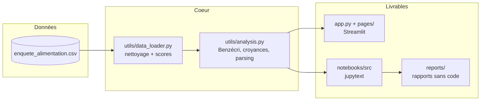

# Enquête Alimentation — habitudes & dynamiques alimentaires

**Analyse d'une enquête déclarative (1 681 répondants, 51 variables) sur les habitudes alimentaires, les croyances nutritionnelles et leurs déterminants sociologiques.**


Le dépôt contient **deux livrables complémentaires** :

1. une **application Streamlit** interactive (exploration libre, filtres, ACM en direct) ;
2. une **série de 5 notebooks** d'analyse, chacun accompagné d'un **rapport lisible**
   (texte + tableaux + images, sans code) pour le partage.

## Architecture

Le code de nettoyage et de calcul est **partagé** entre l'application et les notebooks
(`utils/`), garantissant des résultats identiques entre l'app interactive et les rapports
statiques.



> Documentation technique complète (méthodo, formules, choix) :
> [DOCUMENTATION.md](DOCUMENTATION.md).

## Démarrage

**Prérequis** : Python ≥ 3.12 et [uv](https://github.com/astral-sh/uv).

```bash
uv venv .venv --python 3.12
uv sync                              # installe les dépendances (pyproject.toml / uv.lock)
```

**Lancer l'application Streamlit** :

```bash
.venv/bin/streamlit run app.py       # puis ouvrir http://localhost:8507
```

| Accès | URL | Note |
|---|---|---|
| Application | http://localhost:8507 | Port fixé dans `.streamlit/config.toml` |

Description des pages : [docs/README_APP.md](docs/README_APP.md).

## Notebooks & rapports d'analyse

Pour lire les analyses **sans rien exécuter**, ouvrir les rapports dans `reports/` :

| # | Thème | Rapport |
|---|---|---|
| 01 | Population | [reports/01_population.md](reports/01_population.md) |
| 02 | Habitudes & scores de santé | [reports/02_habitudes.md](reports/02_habitudes.md) |
| 03 | Espace social alimentaire (ACM) | [reports/03_sociologie_acm.md](reports/03_sociologie_acm.md) |
| 04 | Croyances vs pratiques | [reports/04_croyances_pratiques.md](reports/04_croyances_pratiques.md) |
| 05 | Marketing & choix | [reports/05_marketing_choix.md](reports/05_marketing_choix.md) |

Index complet et méthode : [notebooks/README.md](notebooks/README.md).

Régénération depuis les sources jupytext (`notebooks/src/*.md`) :

```bash
bash notebooks/build.sh                 # tout
bash notebooks/build.sh 02_habitudes    # un seul
```

Le script enchaîne `jupytext` (md → ipynb) → exécution (`nbconvert --execute`) → rapport
sans code (`nbconvert --no-input`, images extraites dans `reports/NN_*_files/`).

## Résultats phares

| Constat | Chiffre clé |
|---|---|
| L'**âge** est le premier déterminant de la qualité alimentaire | régression OLS, R² ≈ **0,09** |
| Le socio-démographique structure faiblement les assiettes | ACM : nuages par âge/diplôme largement superposés |
| Connaissances nutritionnelles solides et **indépendantes du diplôme** | ANOVA de Welch, p = **0,16** |
| Le levier n'est pas le savoir mais le **passage à l'acte** | « 5 fruits & légumes » appliqués : *d* ≈ **1,0** |
| La publicité pousse vers les **produits industriels** | *d* ≈ **0,5**, alors que 5 % seulement s'avouent influençables |

## Structure du projet

```text
food-habits-analysis/
├── app.py                  # point d'entrée de l'application Streamlit
├── pages/                  # pages de l'app (Population, Habitudes, Sociologie, Croyances, Marketing)
├── utils/                  # code partagé app + notebooks
│   ├── data_loader.py      #   load_data() / clean_data() / scores
│   ├── analysis.py         #   Benzécri, grille des croyances, parsing choix multiples
│   └── dict_questions_colonnes.py   # libellés des questions
├── data/                   # données brutes (enquete_alimentation.csv)
├── notebooks/              # analyses
│   ├── src/                #   sources jupytext (.md, éditables)
│   ├── *.ipynb             #   notebooks exécutés (code + sorties)
│   ├── build.sh            #   régénère ipynb + rapports depuis src/
│   └── README.md           #   index détaillé des analyses
├── reports/                # rapports sans code (.md + images) — pour lecture/partage
├── scripts/                # scripts d'exploration / dev (hors app)
├── docs/                   # Plan.md, README_APP.md, captures, sorties annexes
├── DOCUMENTATION.md        # documentation technique (méthodo, formules, choix)
└── README.md
```

## Licences & composants

| Composant | Rôle | Licence |
|---|---|---|
| pandas / NumPy | Manipulation & calcul | BSD-3-Clause |
| SciPy / statsmodels | Tests statistiques, régression OLS | BSD-3-Clause |
| pingouin | Tests statistiques (Welch, tailles d'effet, Games-Howell) | GPL-3.0 |
| prince | Analyse factorielle (ACM) | MIT |
| matplotlib / seaborn | Visualisation | matplotlib (PSF-based) / BSD-3-Clause |
| plotly | Visualisation interactive | MIT |
| wordcloud | Nuages de mots | MIT |
| jupytext / nbconvert | Notebooks (source ⇄ ipynb ⇄ rapports) | MIT / BSD-3-Clause |
| Streamlit | Application web | Apache-2.0 |
| openpyxl | Lecture Excel | MIT |
| **Ce projet** | Code applicatif | MIT — Copyright (c) 2026 floSa (aucun fichier LICENSE présent) |
