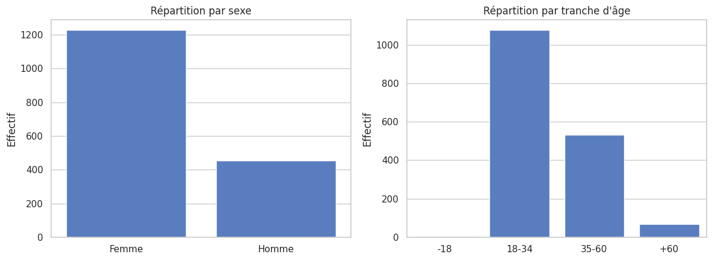
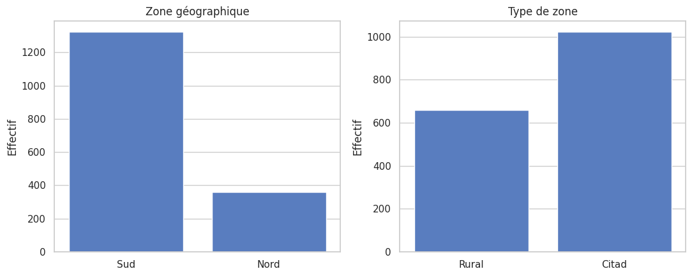
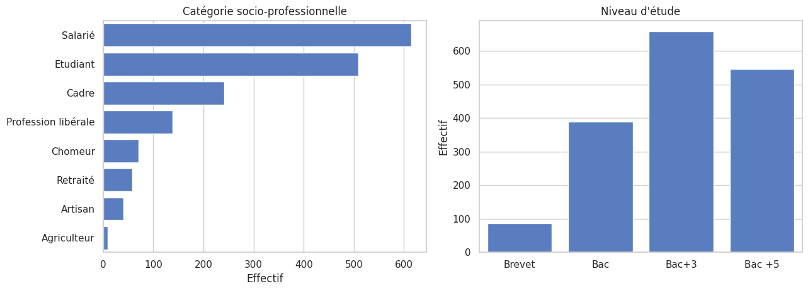
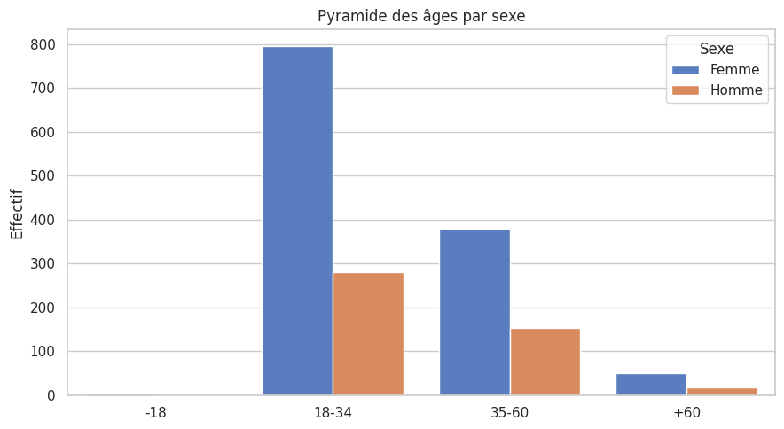
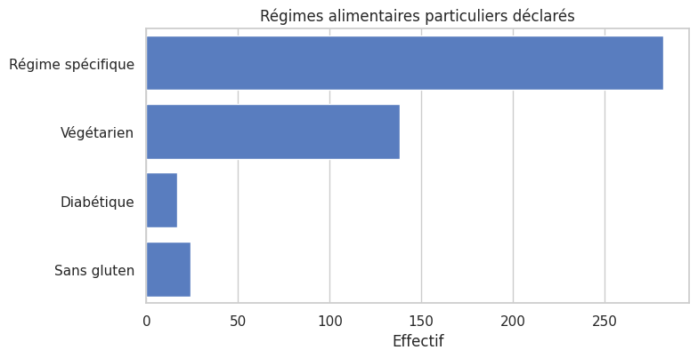

# 01 — Population : qui sont les répondants ?

Ce notebook ouvre la série d'analyses de l'enquête alimentaire. Avant d'interpréter
*ce que les gens mangent et croient*, il faut savoir **qui** a répondu : c'est l'objet
de cette première étape.

On y décrit le profil socio-démographique de l'échantillon (sexe, âge, géographie,
catégorie socio-professionnelle, niveau d'étude, régimes particuliers) et on en tire
les **limites de représentativité** à garder en tête pour tous les notebooks suivants.

## 1. Préparation des données

On réutilise les fonctions de chargement et de nettoyage de l'application
(`utils/data_loader.py`) afin que notebooks et application reposent exactement sur la
même logique : conversion des fréquences de consommation en scores numériques,
recodage des tranches d'âge et du sexe.

    1681 répondants, 62 colonnes après enrichissement

Le jeu de données compte **1 681 répondants**. Le nombre de colonnes est supérieur aux
51 variables brutes du questionnaire car `clean_data` ajoute les scores de consommation
numériques (`*_num`) et les scores synthétiques, exploités dans les notebooks suivants.

## 2. Vue d'ensemble

Quelques indicateurs de cadrage avant d'entrer dans le détail.

| Indicateur          | Valeur   |
|:--------------------|:---------|
| Répondants          | 1681     |
| Variables           | 62       |
| % Femmes            | 73.1 %   |
| % Zone rurale       | 39.2 %   |
| % Régime spécifique | 16.8 %   |

L'échantillon est **majoritairement féminin** (≈ 73 %) et **plutôt urbain** (≈ 61 %).
Un répondant sur six déclare suivre un régime alimentaire particulier. Ces premiers
chiffres annoncent déjà un échantillon éloigné de la population générale.

## 3. Profil démographique : sexe et âge

On visualise la répartition par sexe et par tranche d'âge (ordonnée du plus jeune au
plus âgé).

    

    

Le déséquilibre est net : près de **trois répondants sur quatre sont des femmes**, et
la tranche **18-34 ans concentre 64 % de l'échantillon** (95 % des répondants ont entre
18 et 60 ans). Les moins de 18 ans et les plus de 60 ans sont quasi absents. On a donc
affaire à une population **jeune et adulte active**, pas à un échantillon tous âges.

## 4. Répartition géographique

Deux dimensions géographiques sont disponibles : la zone macro (Nord / Sud) et le type
de territoire (rural / citadin).

    

    

La collecte est **fortement concentrée dans le Sud** (≈ 79 % des répondants) et penche
vers les zones **citadines** (≈ 61 %). Toute lecture d'un effet « géographique » dans les
notebooks suivants devra tenir compte de ce déséquilibre Nord/Sud marqué.

## 5. Catégorie socio-professionnelle et niveau d'étude

On décrit la structure sociale de l'échantillon : profession et diplôme.

    

    

Les **salariés** et les **étudiants** forment le gros des répondants, cohérent avec la
domination des 18-34 ans. Surtout, l'échantillon est **très diplômé** : près de **72 %
ont au moins un Bac+3**. C'est un biais de niveau d'étude majeur, qui pèse directement sur
les connaissances nutritionnelles et les pratiques observées plus loin.

## 6. Croisement âge × sexe

On croise les deux variables démographiques principales pour visualiser la structure
fine de l'échantillon.

    

    

Le tableau de contingence chiffre cette structure.

| Age   |   Femme |   Homme |
|:------|--------:|--------:|
| -18   |       3 |       2 |
| 18-34 |     795 |     281 |
| 35-60 |     380 |     153 |
| +60   |      50 |      17 |

La surreprésentation féminine se vérifie **dans toutes les tranches d'âge** : ce n'est pas
l'effet d'une classe d'âge particulière mais un biais transversal de l'échantillon. Les
femmes de 18-34 ans constituent à elles seules près de la moitié des répondants.

## 7. Régimes alimentaires particuliers

Au-delà du socio-démographique, on relève les régimes spécifiques déclarés, qui peuvent
modifier la lecture des consommations.

    

    

Le détail chiffré :

| Régime            |   Effectif |   % échantillon |
|:------------------|-----------:|----------------:|
| Régime spécifique |        282 |            16.8 |
| Végétarien        |        138 |             8.2 |
| Diabétique        |         17 |             1   |
| Sans gluten       |         24 |             1.4 |

Le **végétarisme** est le régime particulier le plus fréquent (≈ 8 %), loin devant les
contraintes médicales (diabète, sans gluten : ~1 % chacune). Cette part non négligeable
de végétariens est à garder en tête lors de l'analyse des consommations de viande.

## 8. Synthèse & limites de représentativité

**Profil type du répondant.** Une femme (≈ 73 %), jeune adulte de 18-34 ans (64 %),
citadine (≈ 61 %), résidant dans le Sud (≈ 79 %), diplômée du supérieur (≈ 72 % de
Bac+3 ou plus), salariée ou étudiante.

**Limites à retenir pour toute la suite.** L'échantillon **n'est pas représentatif** de
la population générale française. Sont nettement surreprésentés : les femmes, les 18-34
ans, les diplômés du supérieur et le Sud. En conséquence :

- les résultats décrivent surtout les habitudes d'un public **jeune, urbain et éduqué** ;
- les comparaisons par sous-groupe à faibles effectifs (−18 ans, +60 ans, agriculteurs,
  diabétiques…) doivent être lues avec **prudence** ;
- les tests statistiques des notebooks suivants restent valides *au sein de l'échantillon*,
  mais leur **généralisation** à la population entière n'est pas garantie.

Ce cadrage posé, on peut passer à l'analyse du cœur du sujet : les **habitudes de
consommation et les scores de santé** (notebook 02).
