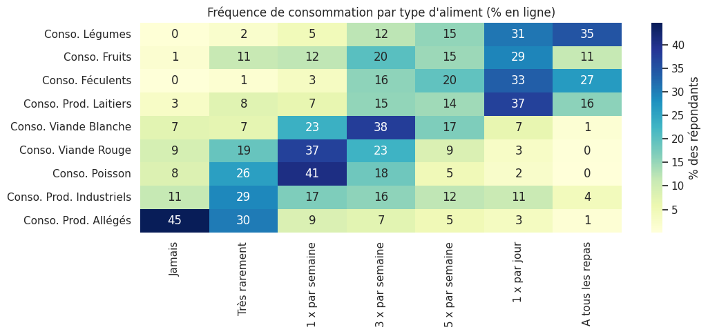
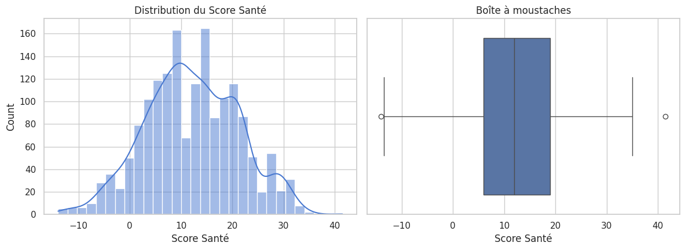
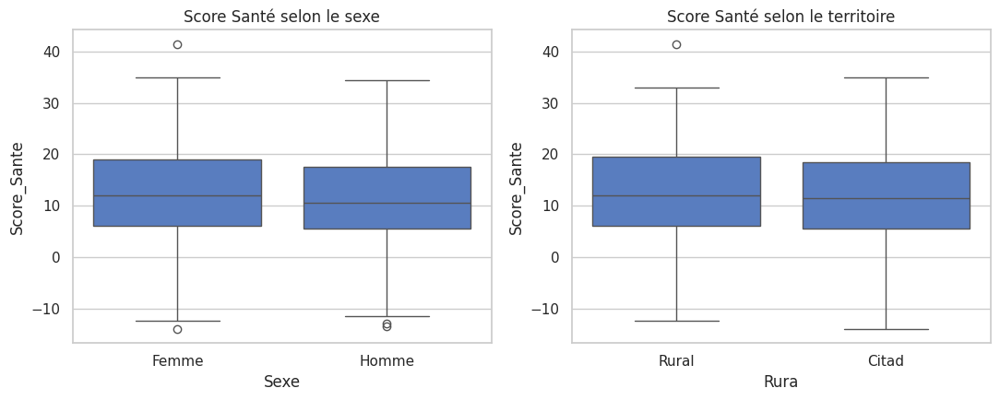
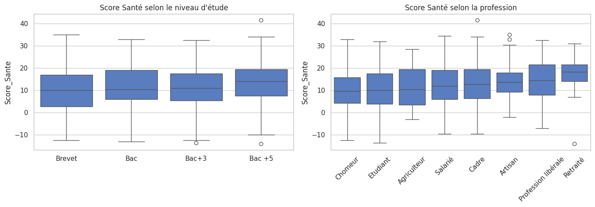
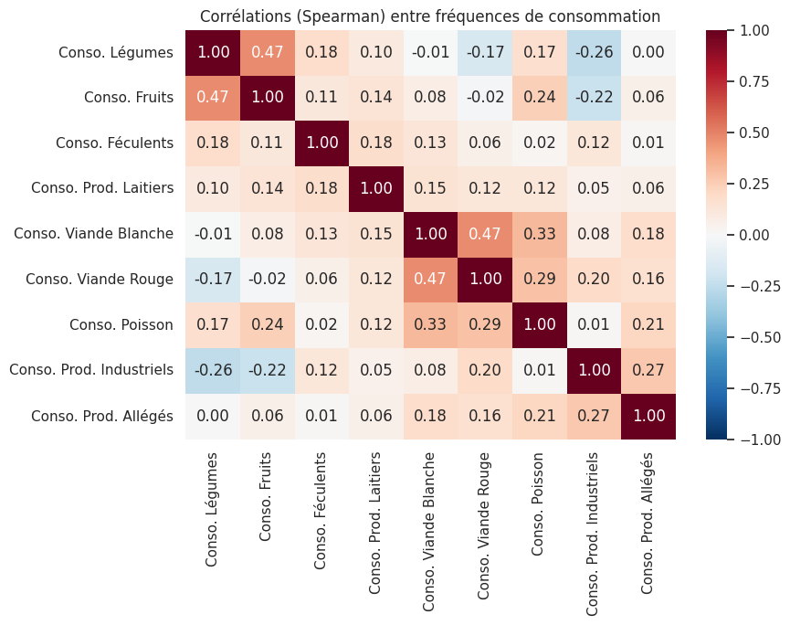

# 02 — Habitudes alimentaires & scores de santé

Ce notebook est le cœur quantitatif de l'analyse. On y décrit **ce que les gens
mangent** (fréquences de consommation), on construit un **Score Santé** synthétique, puis
on teste de façon approfondie **qui mange le mieux** : différences selon le sexe, le
territoire, le niveau d'étude et la profession, avec tailles d'effet, tests post-hoc et
un modèle de régression pour démêler les facteurs confondus.

Rappel du notebook 01 : l'échantillon est jeune, féminin, urbain et diplômé — les
résultats valent d'abord *au sein de cet échantillon*.

## 1. Préparation

On charge les données nettoyées (mêmes fonctions que l'application) et la librairie
`pingouin` pour les tests statistiques, `statsmodels` pour la régression.

    1681 répondants chargés

## 2. Fréquences de consommation par aliment

Pour chaque famille d'aliments, on calcule la répartition des fréquences déclarées (en %
de répondants), de « Jamais » à « À tous les repas ». La heatmap se lit en ligne.

    

    

Deux blocs se dégagent nettement. Les **légumes, fruits, féculents et produits laitiers**
sont consommés quotidiennement par une large majorité (35 % mangent des légumes à *tous
les repas*). À l'inverse, **viande rouge, poisson, produits industriels et allégés** sont
rares : la viande rouge ne dépasse jamais « 1 fois par jour » que pour 3 % des répondants,
et 45 % ne consomment **jamais** de produits allégés. On a donc une population qui se
déclare plutôt « végétale et fraîche » — déclaratif à prendre avec la prudence d'usage.

## 3. Des fréquences aux scores de santé

Les fréquences textuelles sont converties en une échelle numérique hebdomadaire
(`Jamais`=0, `1 x par semaine`=1, …, `À tous les repas`=14). Deux scores synthétiques en
découlent (définis dans `utils/data_loader.py`) :

- **Score Santé** = Légumes + Fruits + Poisson − Produits industriels ;
- **Score Carné** = Viande rouge + Viande blanche.

*Limite assumée* : avant calcul, les valeurs manquantes des composantes sont remplacées
par la médiane de la colonne ; le score n'est donc pas un manquant-robuste, et sa valeur
absolue n'a pas de sens « clinique ». Il sert de **mesure relative** pour comparer des
sous-groupes, ce qui est précisément notre usage ici.

|             |   mean |   std |   min |   25% |   50% |   75% |   max |
|:------------|-------:|------:|------:|------:|------:|------:|------:|
| Score_Sante |   12.1 |   9   |   -14 |     6 |    12 |    19 |  41.5 |
| Score_Carné |    4.7 |   3.4 |     0 |     2 |     4 |     6 |  28   |

Le Score Santé s'étale de −14 à +41 (moyenne 12,1). Cette dispersion large est une bonne
nouvelle : le score discrimine suffisamment les profils pour que les comparaisons de
groupes aient du sens.

## 4. Distribution du Score Santé

On visualise la distribution avant de la soumettre aux tests.

    

    

La distribution est unimodale, centrée autour de 12, légèrement asymétrique. Le test de
**Shapiro-Wilk rejette la normalité** (p < 0,001) — attendu sur 1 681 observations où le
moindre écart devient significatif. Par prudence, on privilégie pour la suite des tests
**robustes à l'hétéroscédasticité et à la non-normalité** (t de Welch, ANOVA de Welch,
post-hoc de Games-Howell).

## 5. Le score varie-t-il selon le sexe et le territoire ?

Comparaisons à deux groupes : **t-test de Welch**, avec taille d'effet (*d* de Cohen) et
intervalle de confiance à 95 % de la différence.

| Facteur   |   Femme (moy.) |   Homme (moy.) |   p-val |   d de Cohen | IC95% diff.   |   Rural (moy.) |   Citad (moy.) |
|:----------|---------------:|---------------:|--------:|-------------:|:--------------|---------------:|---------------:|
| Sexe      |          12.37 |          11.52 |   0.085 |        0.094 | [-0.12, 1.81] |         nan    |         nan    |
| Rura      |         nan    |         nan    |   0.06  |        0.094 | [-0.04, 1.74] |          12.66 |          11.81 |

    

    

Surprise : **ni le sexe ni le territoire ne produisent de différence significative**
(p = 0,085 et p = 0,06) et les tailles d'effet sont négligeables (*d* ≈ 0,09). L'idée reçue
« les femmes / les ruraux mangent mieux » ne se vérifie pas ici à l'échelle brute. On verra
au § 8 que le sexe ressort *une fois l'âge contrôlé* — un effet réel mais masqué.

## 6. Le score selon la position sociale (éducation, profession)

Comparaisons à plus de deux groupes. On vérifie d'abord l'homogénéité des variances
(**Levene**), puis on applique l'**ANOVA de Welch** (robuste), la taille d'effet η²
(*partial eta-squared*) et le post-hoc de **Games-Howell** (paires significatives).

| Facteur   |   Levene p |   Welch F |   p-val |   η² (np2) |
|:----------|-----------:|----------:|--------:|-----------:|
| Etud      |      0.462 |       6   | 0.00053 |      0.011 |
| pro       |      0.331 |      10.4 | 5.4e-10 |      0.04  |

    

    

Les paires de professions significativement différentes (Games-Howell) :

| A        | B                   |   diff |   pval |   g de Hedges |
|:---------|:--------------------|-------:|-------:|--------------:|
| Etudiant | Retraité            | -7.529 |  0     |        -0.835 |
| Etudiant | Profession libérale | -4.426 |  0     |        -0.489 |
| Chomeur  | Retraité            | -8.243 |  0     |        -0.902 |
| Retraité | Salarié             |  5.576 |  0     |         0.653 |
| Cadre    | Etudiant            |  3.025 |  0.001 |         0.332 |
| Cadre    | Retraité            | -4.504 |  0.004 |        -0.515 |
| Etudiant | Salarié             | -1.953 |  0.006 |        -0.22  |
| Chomeur  | Profession libérale | -5.141 |  0.01  |        -0.559 |

Les deux facteurs sont significatifs, mais d'ampleur modeste : l'éducation explique à peine
1 % de la variance (η² = 0,011 ; seul **Bac+5** se détache vers le haut), la profession
davantage (η² = 0,040). Le classement professionnel est éloquent : **retraités** (17,8) et
**professions libérales** (14,7) en tête, **chômeurs** (9,6) et **étudiants** (10,3) en bas.
Mais « retraité » est largement un proxy de l'âge — d'où la nécessité d'un modèle
multivarié.

## 7. Quelles consommations vont ensemble ?

Corrélations de **Spearman** (adaptées aux échelles ordinales) entre les fréquences
numériques de consommation.

    

    

La structure dessine deux « mondes » alimentaires cohérents : **fruits ↔ légumes**
(ρ = 0,47) d'un côté, **viande rouge ↔ viande blanche** (ρ = 0,47) de l'autre. Surtout, les
**produits industriels sont négativement corrélés aux légumes et aux fruits** (ρ ≈ −0,26 et
−0,22) : manger frais et manger industriel s'excluent partiellement — l'opposition de fond
que l'ACM du notebook 03 va spatialiser.

## 8. Modèle explicatif : régression du Score Santé

Pour démêler les effets confondus (la profession « retraité » porte de l'âge, etc.), on
régresse le Score Santé sur le sexe, l'âge, le niveau d'étude et le territoire
(**OLS**, modalités de référence : Femme, +60 ans, Bac, Citadin).

|                   |   coef. |   p-val |   IC 2.5% |   IC 97.5% |
|:------------------|--------:|--------:|----------:|-----------:|
| Intercept         |  18.906 |   0     |    16.561 |     21.252 |
| C(Sexe)[T.Homme]  |  -1.049 |   0.028 |    -1.986 |     -0.112 |
| C(Age)[T.-18]     |  -9.898 |   0.014 |   -17.82  |     -1.977 |
| C(Age)[T.18-34]   |  -9.367 |   0     |   -11.589 |     -7.145 |
| C(Age)[T.35-60]   |  -4.82  |   0     |    -7.045 |     -2.595 |
| C(Etud)[T.Bac +5] |   3.143 |   0     |     1.975 |      4.311 |
| C(Etud)[T.Bac+3]  |   0.551 |   0.325 |    -0.548 |      1.65  |
| C(Etud)[T.Brevet] |  -3.143 |   0.003 |    -5.216 |     -1.071 |
| C(Rura)[T.Rural]  |  -0.01  |   0.982 |    -0.919 |      0.898 |

**R² = 0.088** (R² ajusté = 0.084) — modèle globalement significatif (p = 2.6e-29).

Le modèle n'explique que **≈ 9 % de la variance** : les déterminants socio-démographiques
ne font qu'une petite partie de l'histoire. Mais il clarifie les rôles :

- **L'âge domine** — par rapport aux 60 ans et plus, les 18-34 ans ont un score inférieur de
  ~9 points (p < 0,001). C'est *lui* qui portait l'effet « retraité » du § 6.
- **L'éducation** joue à la marge mais réellement : **Bac+5** +3,1 pts, **Brevet** −3,1 pts.
- **Le sexe** devient significatif une fois l'âge neutralisé : les hommes −1,0 pt
  (p = 0,028) — l'effet existait, masqué par la structure d'âge différente des deux sexes.
- **Le territoire** (rural/citadin) reste **sans effet** (p = 0,98).

## 9. Synthèse

**Ce que mangent les répondants.** Une alimentation déclarée à dominante végétale et
fraîche (légumes/fruits/féculents quotidiens), une viande rouge et des produits industriels
peu fréquents, des produits allégés massivement délaissés.

**Qui mange le mieux ?** Les écarts existent mais sont **modestes** :

- pas de différence brute selon le **sexe** ni le **territoire** ;
- un gradient **éducatif** faible (Bac+5 au-dessus) et **professionnel** plus net, mais ce
  dernier reflète surtout l'**âge** ;
- toutes variables socio confondues, **l'âge est le premier déterminant** (les plus jeunes
  ont les scores les plus bas), devant l'éducation puis un léger effet de sexe.

**Limite de fond.** Le modèle n'explique que ~9 % de la variance : l'essentiel des
différences de score se joue **ailleurs** que dans le socio-démographique — sans doute du
côté des goûts, des contraintes et des **croyances**, qu'on aborde aux notebooks 03 (espace
social, ACM) et 04 (croyances vs pratiques).
