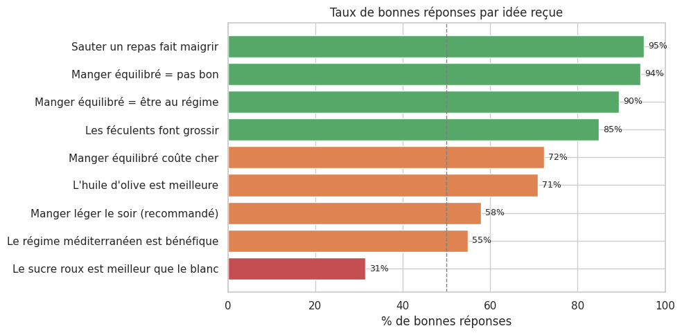
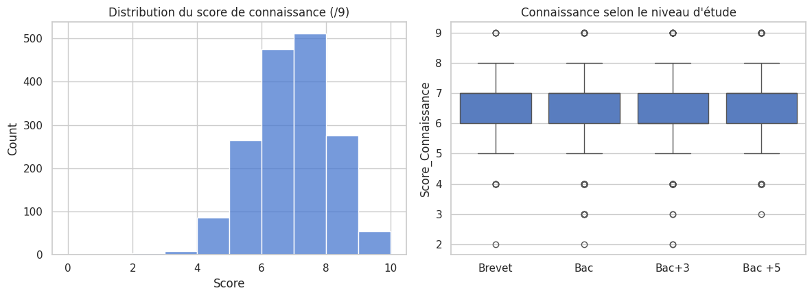
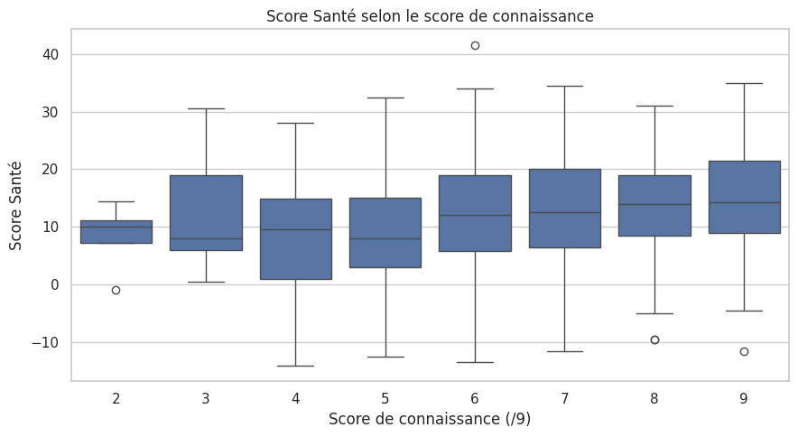
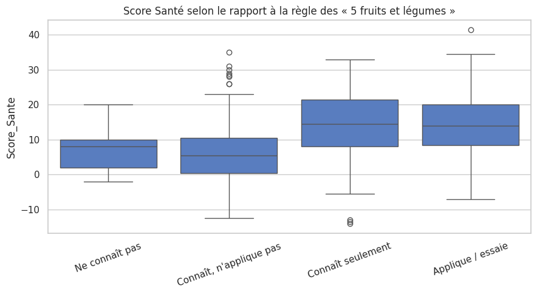

# 04 — Croyances, connaissances et pratiques

Les notebooks 02 et 03 ont montré que *ce qu'on mange* se déduit mal de *qui l'on est*
socialement. Reste une autre piste : les **croyances et connaissances** nutritionnelles.
Les gens qui savent mangent-ils mieux ? Ce notebook confronte trois niveaux :

1. les **idées reçues** (questions Vrai/Faux `VF_*`) et le taux de bonnes réponses ;
2. un **score de connaissance** synthétique et ses déterminants ;
3. la confrontation **connaissance ↔ pratique** (Score Santé), et le rôle décisif du
   **passage à l'acte** (règle des « 5 fruits et légumes »).

## 1. Préparation et grille de correction

Pour chaque idée reçue, on fixe la **bonne réponse** (« Oui » = l'affirmation est vraie). On
ne garde que les réponses tranchées (« Oui » ou « Non »), en écartant la poignée de réponses
ambiguës « Oui, Non ».

    9 idées reçues évaluées sur 1681 répondants

## 2. Quelles idées reçues résistent ?

On calcule le taux de bonnes réponses pour chaque affirmation.

    

    

Le contraste est saisissant. Les mythes les plus « scolaires » sont massivement déjoués :
*sauter un repas fait maigrir* (95 %), *équilibré = pas bon* (94 %), *= régime* (90 %). Mais
trois croyances résistent : l'idée que le **sucre roux serait meilleur que le blanc** n'est
rejetée que par **31 %** (deux personnes sur trois y croient), et seule une courte majorité
sait que le **régime méditerranéen** est bénéfique (55 %) ou que **manger léger le soir** est
recommandé (58 %). Les connaissances sont donc **inégales selon le sujet**, fortes sur les
messages de prévention grand public, faibles sur les détails nutritionnels.

## 3. Score de connaissance et niveau d'étude

On agrège les neuf réponses en un **score de connaissance** (0 à 9) et on teste s'il dépend
du diplôme — l'intuition étant que les plus diplômés en savent plus.

Score moyen : **6.44/9**. ANOVA de Welch selon le diplôme : F = 1.71, **p = 0.16** → pas de différence significative.

    

    

Le score moyen est élevé (6,4/9) : la culture nutritionnelle de base est largement répandue.
Surtout, **le niveau d'étude ne fait aucune différence** (p = 0,16) : du Brevet au Bac+5, on
sait à peu près la même chose. C'est un résultat fort — la connaissance nutritionnelle ne se
distribue pas comme le capital scolaire.

## 4. Savoir, est-ce manger mieux ?

Le test central du notebook : le score de connaissance est-il lié au Score Santé (pratique
déclarée) ?

Corrélation de Spearman connaissance ↔ Score Santé : **ρ = 0.18** (p = 2.1e-13).

    

    

La relation est **positive mais faible** (ρ = 0,18). Connaître les bons principes va de pair
avec une alimentation un peu meilleure, mais la connaissance **n'explique presque rien** des
écarts de pratique. Le savoir ne suffit pas : c'est tout l'écart entre *savoir* et *faire*.

## 5. Le vrai clivage : appliquer, pas seulement savoir

La règle des « 5 fruits et légumes par jour » permet de séparer ceux qui **connaissent** la
reco de ceux qui **l'appliquent**. On compare leur Score Santé.

« Applique / essaie » (moy. 14.1) vs « connaît mais n'applique pas » (moy. 6.0) : t-test **p = 2.3e-54**, **d de Cohen = 0.99** (effet large).

    

    

Voilà l'écart décisif. Entre ceux qui **essaient d'appliquer** la règle et ceux qui la
**connaissent sans l'appliquer**, la différence de Score Santé est **énorme** (14,1 vs 6,0 ;
*d* ≈ 1,0, l'un des plus gros effets de toute l'étude). Or presque tout le monde *connaît* la
règle : ce qui distingue les bons mangeurs n'est pas l'information, c'est la **mise en
pratique**.

## 6. Conscience du lien alimentation-santé

Dernier point de cadrage : les répondants font-ils le lien entre alimentation et santé ?

| Affirmation                                |   % « Oui » |
|:-------------------------------------------|------------:|
| L'alimentation peut causer des pathologies |        98.2 |
| L'alimentation impacte la santé            |        99.5 |

La conscience du lien alimentation-santé est **quasi universelle** (98-99 %). Le problème
n'est donc ni la sensibilisation générale, ni l'ignorance des grands principes : c'est, à
nouveau, le passage du savoir à l'acte.

## 7. Synthèse

**Ce que les gens savent.** La culture nutritionnelle de base est solide et, fait notable,
**indépendante du diplôme**. Les mythes « moraux » (sauter un repas, équilibré = privation)
sont déjoués ; restent quelques angles morts techniques, au premier rang desquels le **sucre
roux** (31 % de bonnes réponses) et la sous-estimation du **régime méditerranéen**.

**Le fossé savoir / faire.** La conscience que l'alimentation impacte la santé est
universelle (≈ 99 %), et le score de connaissance est élevé — mais il ne corrèle que
**faiblement** avec la pratique (ρ = 0,18). Savoir ne suffit pas.

**Le vrai levier : l'application.** La fracture nette ne sépare pas les savants des
ignorants, mais ceux qui **appliquent** des autres : essayer de suivre la règle des 5 fruits
et légumes va de pair avec un Score Santé deux fois supérieur (*d* ≈ 1,0). Pour une politique
de prévention, l'implication est claire : **informer ne suffit pas, il faut agir sur le
passage à l'acte** (motivation, accessibilité, habitudes) — ce que le notebook 05 explore via
les déterminants d'achat et l'influence marketing.
