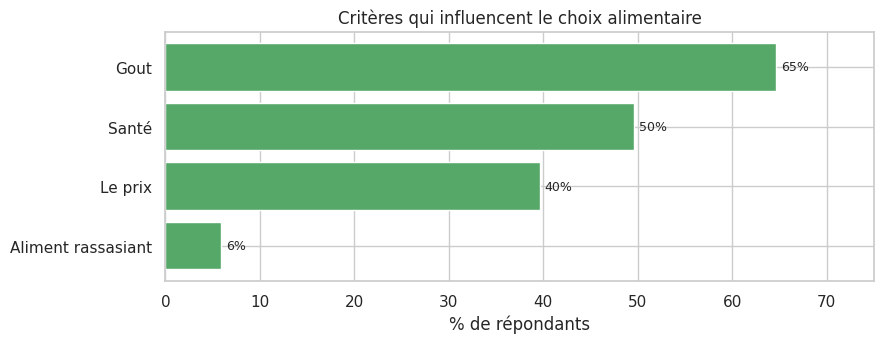
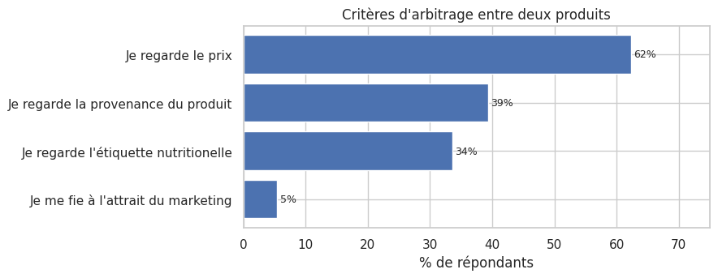
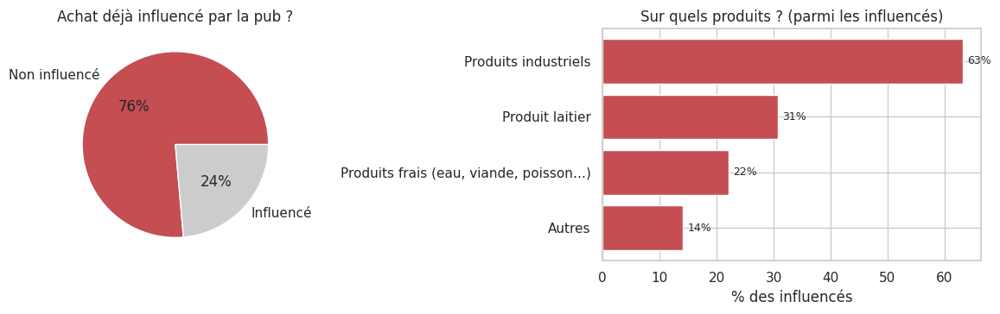
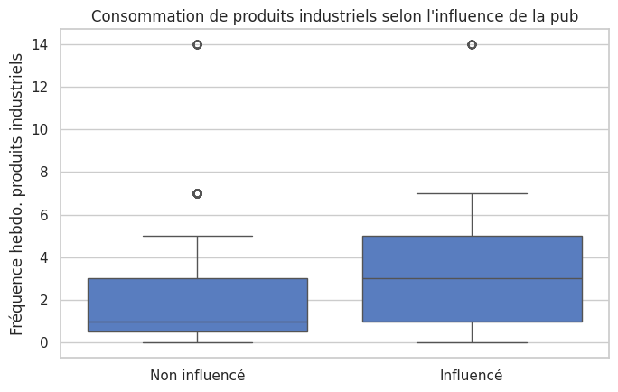

# 05 — Déterminants du choix & influence marketing

Le notebook 04 a conclu que le levier n'est pas le savoir mais le **passage à l'acte**.
Cet acte, c'est d'abord un acte d'**achat**. Ce dernier notebook examine ce qui guide le
choix alimentaire — goût, prix, santé — le rôle (souvent nié) de la **publicité**, et la
manière dont les répondants se représentent « manger équilibré » à travers leurs réponses
libres.

## 1. Préparation

Plusieurs questions sont à choix multiples (réponses séparées par des virgules). On définit
un compteur qui éclate ces réponses pour mesurer la fréquence de chaque option.

    Préparation OK

## 2. Qu'est-ce qui guide le choix alimentaire ?

Critère de choix déclaré (`Crit_influe_C`), en % de répondants (plusieurs réponses
possibles).

    

    

Le **goût arrive largement en tête** (65 %), devant la **santé** (50 %) et le **prix**
(40 %). Le caractère rassasiant ne compte presque pas (6 %). La santé est donc une
préoccupation déclarée majeure — mais elle reste seconde derrière le plaisir gustatif, ce
qui éclaire le fossé savoir/faire du notebook 04 : on *sait* ce qui est sain, mais c'est le
goût qui décide.

## 3. L'arbitrage en rayon

Face à deux produits, sur quoi se décide-t-on concrètement (`Choix`) ?

Par ailleurs, **84%** se déclarent attentifs aux produits frais.

    

    

Au moment de l'achat, c'est le **prix qui tranche** (62 %), devant la provenance (39 %) et
l'étiquette nutritionnelle (34 %). Fait notable : seuls **5 % admettent se fier à l'attrait
marketing**. Personne ne se croit influençable — une dénégation que la suite va mettre à
l'épreuve.

## 4. L'influence de la publicité

La question `Pub` demande si un achat a déjà été influencé par la publicité, et sur quels
produits. On sépare d'abord influencés et non-influencés, puis on détaille les catégories
citées (libellés parsés par sous-chaîne, car ils contiennent des virgules).

    

    

Environ **un quart des répondants reconnaît avoir déjà acheté sous l'effet de la pub** — bien
plus que les 5 % qui s'avouaient sensibles au marketing dans l'arbitrage. Et lorsque la pub
agit, c'est massivement sur les **produits industriels** (63 % des influencés), loin devant le
reste.

## 5. La pub pousse-t-elle vraiment à la « malbouffe » ?

On teste l'hypothèse directement : les personnes influencées par la pub consomment-elles
plus de produits industriels (`C_indu_num`) ? T-test de Welch avec taille d'effet.

Influencés : moy. **3.95** vs non-influencés : **2.35** — t-test **p = 6.5e-14**, **d de Cohen = 0.50** (effet moyen).

    

    

L'hypothèse est **confirmée** : les personnes sensibles à la pub consomment nettement plus de
produits industriels (3,95 vs 2,35 par semaine ; *d* ≈ 0,50, effet moyen, hautement
significatif). Le contraste avec le § 3 est éclairant : presque personne ne se *croit*
influençable, mais l'influence se **lit dans les assiettes**. La publicité opère surtout sur
le segment industriel — précisément les produits que l'alimentation « santé » cherche à
limiter.

## 6. Comment se représente-t-on « manger équilibré » ?

Enfin, on explore la question ouverte « C'est quoi manger équilibré ? » (`Mangé_E`) par un
nuage de mots (mots-outils français retirés).

    

    

La définition spontanée de l'équilibre alimentaire tourne autour de trois idées : la
**variété** (« varier », « varié »), la **modération** (« quantité », « raisonnable »,
« éviter », « gras », « sucre ») et les **groupes d'aliments** (« légumes », « viande »,
« féculents », « protéines »). Une définition saine et conforme aux messages de santé
publique — ce qui confirme une fois encore que **le savoir n'est pas le maillon faible**.

## 7. Synthèse — et conclusion de la série

**Ce qui guide le choix.** Le **goût** prime sur la santé et le prix au moment de choisir un
aliment ; mais en rayon, face à deux produits, c'est le **prix** qui tranche. L'étiquette
nutritionnelle ne pèse que pour un tiers des répondants.

**Le marketing, angle mort.** Seuls 5 % se disent sensibles au marketing, mais un quart
reconnaît des achats sous influence publicitaire, et ce groupe consomme significativement
plus de **produits industriels** (*d* ≈ 0,5). L'influence existe, ciblée sur la malbouffe, et
elle est largement sous-estimée par ceux qui la subissent.

---

**Conclusion générale des cinq notebooks.** L'enquête dessine un portrait cohérent :

1. un échantillon **jeune, féminin, diplômé, urbain** (peu représentatif — notebook 01) ;
2. une alimentation déclarée plutôt saine, dont les écarts de qualité tiennent surtout à
   l'**âge**, très peu au sexe ou au territoire (notebook 02) ;
3. un espace de consommation **faiblement structuré par le social** : on ne peut pas déduire
   l'assiette de la position sociale (notebook 03) ;
4. des **connaissances solides et indépendantes du diplôme**, mais déconnectées de la
   pratique : le levier est le **passage à l'acte**, pas l'information (notebook 04) ;
5. un choix gouverné par le **goût** et le **prix**, et une **publicité** qui pousse
   discrètement mais réellement vers les produits industriels (notebook 05).

**Implication.** Pour améliorer l'alimentation de ce public, informer davantage serait
largement inutile : tout le monde sait déjà. Les leviers efficaces se situent du côté de
l'**aide au passage à l'acte** (accessibilité, prix, habitudes) et de la **réduction de
l'exposition marketing** aux produits industriels.
